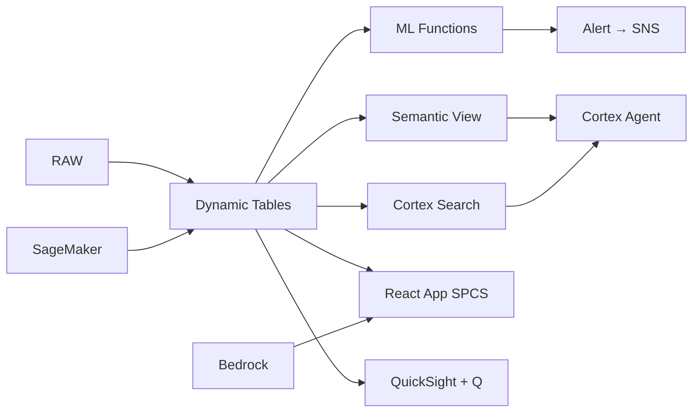

# Microinsurance Claims Analytics & Fraud Detection

55M uninsured Filipinos — microinsurance claims must be processed in 24 hours or customers lose trust. Snowflake parses claim documents with AI, classifies fraud with ML, and alerts adjusters before payouts — all in native SQL.

## Architecture

55 million Filipinos lack insurance coverage. Microinsurance — affordable policies under ₱500 annual premium — is the solution. But claims processing is the trust-breaker: if a farmer in Mindanao waits 2 weeks for a ₱10,000 payout after a typhoon, they'll never renew. The Insurance Commission mandates 24-hour processing. Snowflake automates document parsing, fraud detection, and adjudication to meet that mandate at scale.



## Snowflake Capabilities

| Capability | Implementation |
|-----------|---------------|
| Dynamic Tables | CLAIMS_ENRICHED / FRAUD_INDICATORS / LOSS_RATIO_ANALYSIS / PROCESSING_METRICS |
| ML Functions | ML.CLASSIFICATION + ML.CLASSIFICATION |
| Cortex AI | AI_PARSE_DOCUMENT, AI_CLASSIFY, COMPLETE |
| Cortex Search | 65 documents indexed |
| Cortex Agent | CLAIMS_INTELLIGENCE_AGENT |
| Semantic View | CLAIMS_ANALYTICS |
| React App (SPCS) | 5 tabs + DemoGuide |


## AWS Services

| Service | Role in Demo |
|---------|-------------|
| Amazon Textract | Extract data from scanned medical certificates and receipts |
| Amazon SageMaker | Claims fraud detection model |
| Amazon Bedrock (Claude) | Generate investigation narratives and decision explanations |
| Amazon SNS | Alert investigators for flagged claims |
| Amazon QuickSight + Q | Claims operations dashboard |
| AWS Step Functions | Orchestrate claims processing workflow |


## Personas

| Persona | Role | Key Questions |
|---------|------|---------------|
| **Teresa Remedios Osmena** | VP Claims & Operations | "What's our average claims processing time this month?" "How many claims are flagged for potential fraud?" |
| **Jose Carlos Roxas** | Claims Investigation Manager | "Which claim types have the highest fraud rate?" "Show me the geographic distribution of suspicious claims." |


## Data

| Table | Rows | Description |
|-------|------|-------------|
| POLICIES | 2,400,000 | Active microinsurance policies (life, health, accident, property) |
| CLAIMS | 185,000 | 12 months of claims submitted |
| CLAIM_DOCUMENTS | 520,000 | Scanned supporting documents (medical certs, receipts, IDs) |
| PAYOUTS | 142,000 | Claims paid with amount and method |
| FRAUD_HISTORY | 3,800 | Confirmed fraudulent claims for model training |
| PRODUCTS | 24 | Microinsurance product catalog |
| IC_REGULATIONS | 65 | Insurance Commission regulatory requirements |


## Build Instructions

### Prerequisites
- Snowflake account with ACCOUNTADMIN access
- Cortex AI enabled (ML Functions, Search, Agent)
- Warehouse: CLAIMS_WH (Medium)
- AWS CLI with access (us-west-2)

### Deployment

```bash
snowsql -f snowflake/00_setup.sql
snowsql -f snowflake/01_marketplace_install.sql
snowsql -f snowflake/02_raw_tables.sql
snowsql -f snowflake/03_staging.sql
snowsql -f snowflake/04_dynamic_tables.sql
snowsql -f snowflake/05_search.sql
snowsql -f snowflake/06_ml_models.sql
snowsql -f snowflake/07_semantic_view.sql
snowsql -f snowflake/08_agent.sql
```

### React App (SPCS)
```bash
cd app && npm ci && npm run build
docker build -t aws-philippines-banking-microinsurance-app .
docker push bdiqc8sm-default.registry.snowflakecomputing.com/microinsurance/app/aws_philippines_banking_microinsurance/app:latest
```

### Demo Mode
Open the app URL with `?demo=true` for presenter view.

## Build Modes

### Snowflake Only
Run scripts 00-08 (skip AWS-specific integration). Uses:
- **AI_PARSE_DOCUMENT (native)** instead of Amazon Textract
- **ML.CLASSIFICATION (native)** instead of Amazon SageMaker
- **Cortex Complete** instead of Amazon Bedrock (Claude)
- **Alerts + Notification Integration** instead of Amazon SNS
- **Snowflake Intelligence (Cortex Analyst)** instead of Amazon QuickSight + Q
- **Task Graphs (DAG orchestration)** instead of AWS Step Functions

### Full AWS + Snowflake
Run all scripts including AWS integration. Deploy QuickSight dashboard from `quicksight/`.

## Business Impact

Industry research and Snowflake customer outcomes:
- **55 million Filipinos lack any form of insurance coverage** — [Insurance Commission Philippines](https://www.insurance.gov.ph/microinsurance/)
- **Philippine microinsurance market grew 28% in 2023 to ₱12B in premiums** — [IC Philippines](https://www.insurance.gov.ph/statistics/)
- **AI-powered claims processing reduces cycle time by 60-80%** — [McKinsey Insurance](https://www.mckinsey.com/industries/financial-services/our-insights)
- **Automated fraud detection saves insurers 15-30% in claims leakage** — [Deloitte Insurance](https://www.deloitte.com/global/en/Industries/financial-services.html)
- **Western Union** (Snowflake customer): processes 1B+ cross-border transactions on Snowflake with real-time compliance and fraud detection -- [snowflake.com/customers/western-union](https://www.snowflake.com/en/customers/all-customers/case-study/western-union/)

## Key Demo Numbers

- **185,000 claims** processed annually (₱2.3B in payouts)
- **18 hours** average processing time (within 24-hour mandate)
- **62%** of claims auto-adjudicated by ML
- **4.8%** of claims flagged as suspicious (₱108M exposure)
- **520K documents** parsed by AI_PARSE_DOCUMENT
- **2.4M policies** active microinsurance coverage


## License

Apache 2.0 — See [LICENSE](LICENSE) for details.

This is a personal demo project and is not an official Snowflake offering. It comes with no support or warranty.